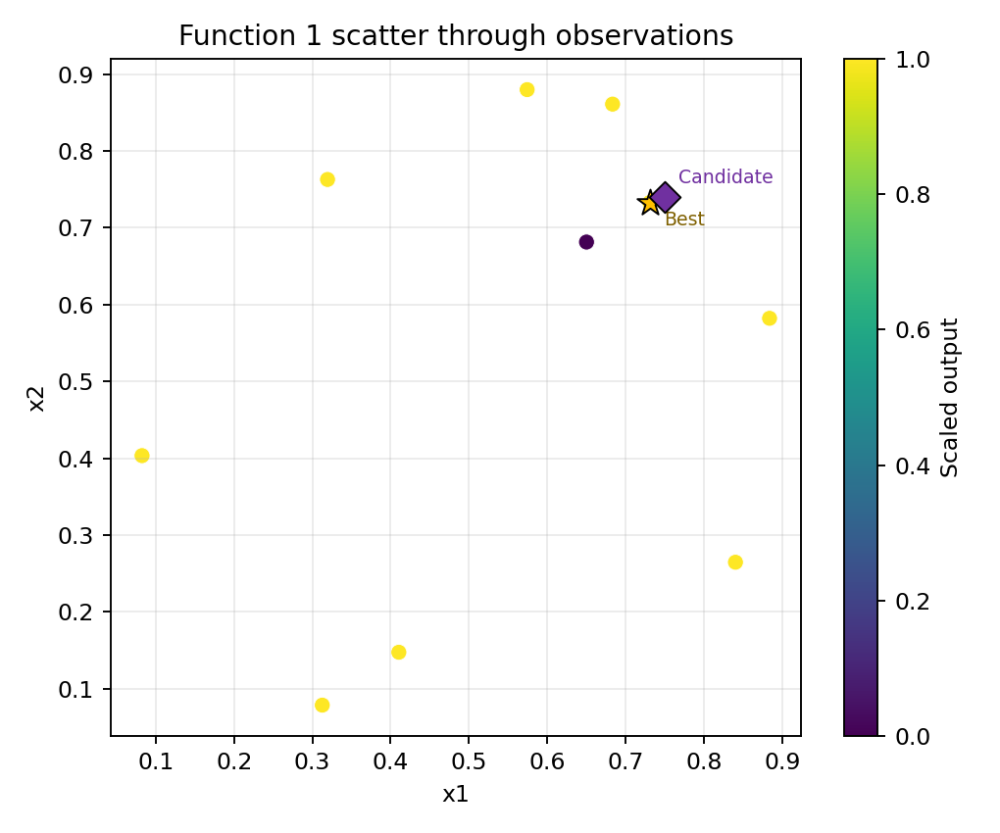
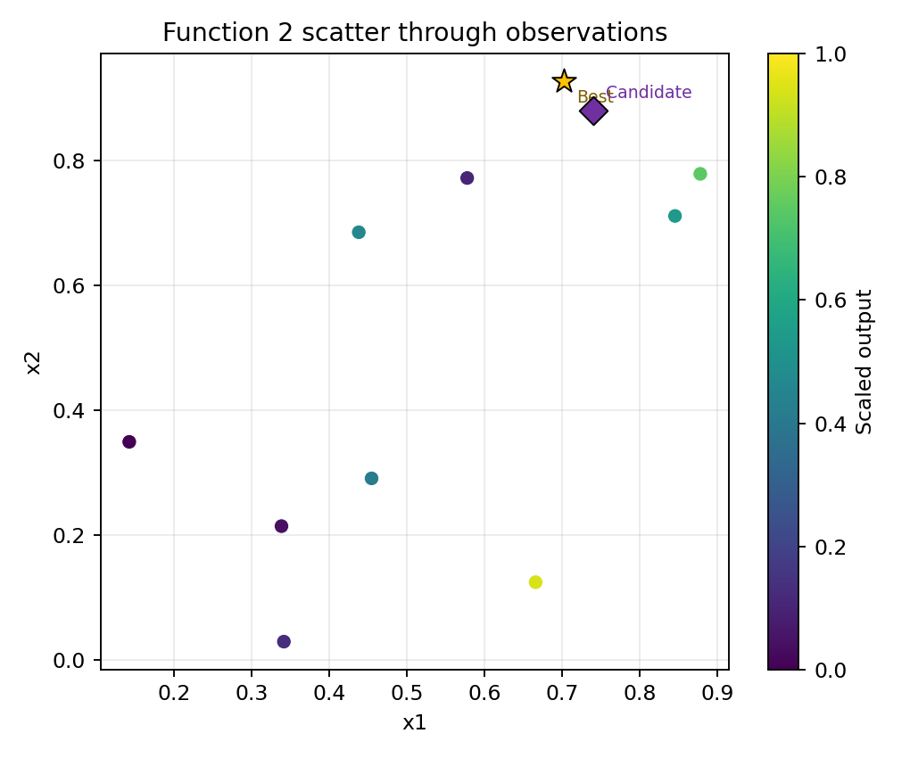
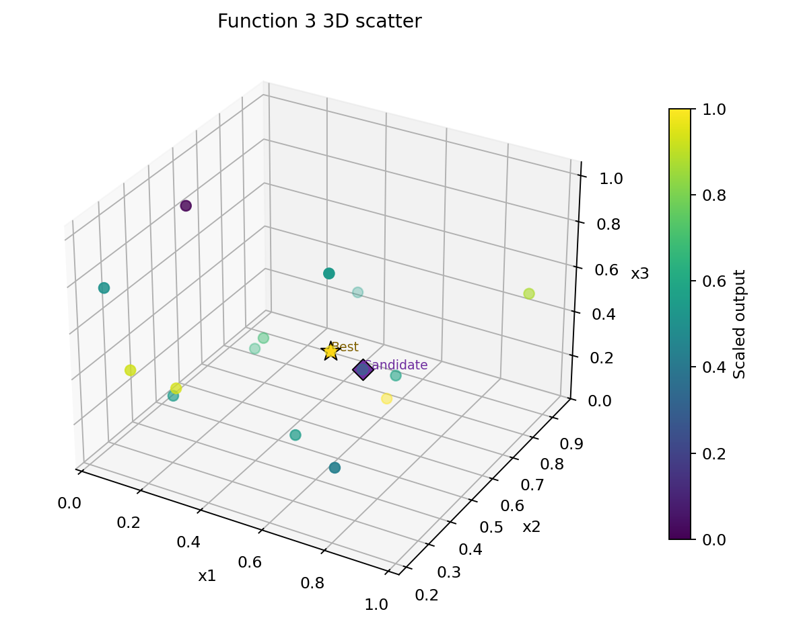
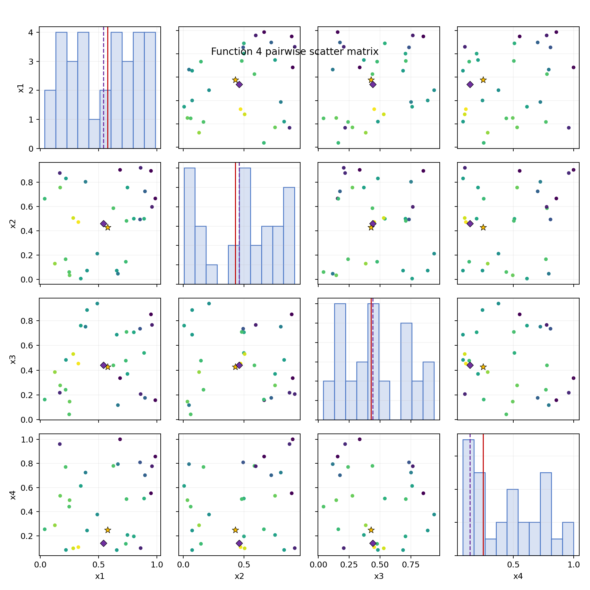

# Week 1 Approach

## Main Principle
The main principle I used was an adaptive balance between exploitation and limited exploration. For the lower-dimensional functions, I relied mainly on exploitation by using scatter plots and local visual reasoning to refine around the best observed regions. For the higher-dimensional functions, I used a random-forest surrogate model to score candidate points and select queries that were predicted to perform well, while still allowing some variation from previously observed inputs. Overall, my heuristic was to exploit where the data showed a clear promising region and use more model-guided exploration where the structure was less interpretable.

## Lower-Dimensional Visuals
These plots show the observed data through Week 1 for Functions 1 to 4, with the Week 1 submitted point overlaid as the candidate marker.

### Function 1

### Function 2

### Function 3

### Function 4

## Most Challenging Functions
The most challenging functions were Function 1 and Function 8, but for different reasons. Function 1 was difficult because the outputs were extremely sparse, with almost all observed values close to zero, which made it hard to infer the shape of the function or identify a broader promising region. Function 8 was challenging because its eight-dimensional input space made the response surface difficult to interpret directly, even with more observations than some of the earlier functions. Function 7 was also challenging for similar reasons, though it showed a clearer standout point. Additional information that would have helped includes more observations per function, some indication of output noise, or uncertainty-aware model diagnostics to distinguish stable high-performing regions from local effects.

## Future Strategy
In future rounds, I plan to keep the same adaptive workflow but update the balance between exploitation and exploration based on the new observations. If a query improves on a promising local region, I will continue refining around that area with smaller, more exploitative moves. If a query performs worse than expected, I will increase exploration by testing a different promising region or by giving the surrogate model more freedom to search less-sampled parts of the space. As uncertainty decreases with each new observation, I expect to become more selective and locally focused for functions that show stable structure, while keeping broader exploration for the functions that remain ambiguous.
