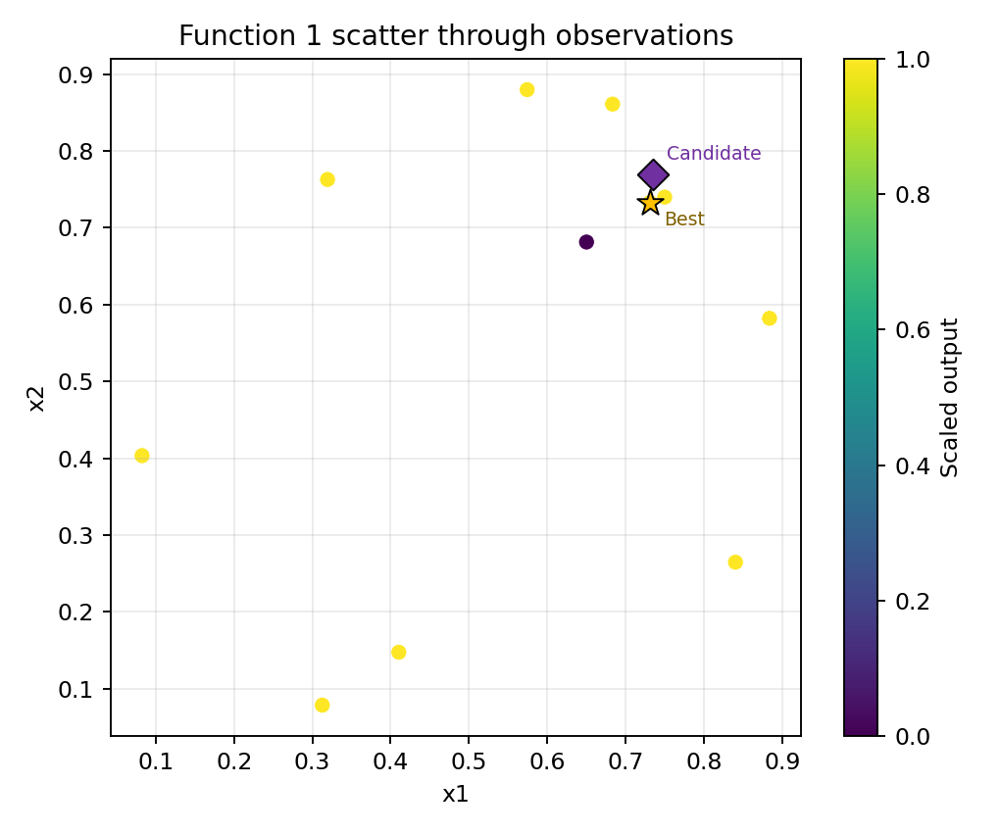
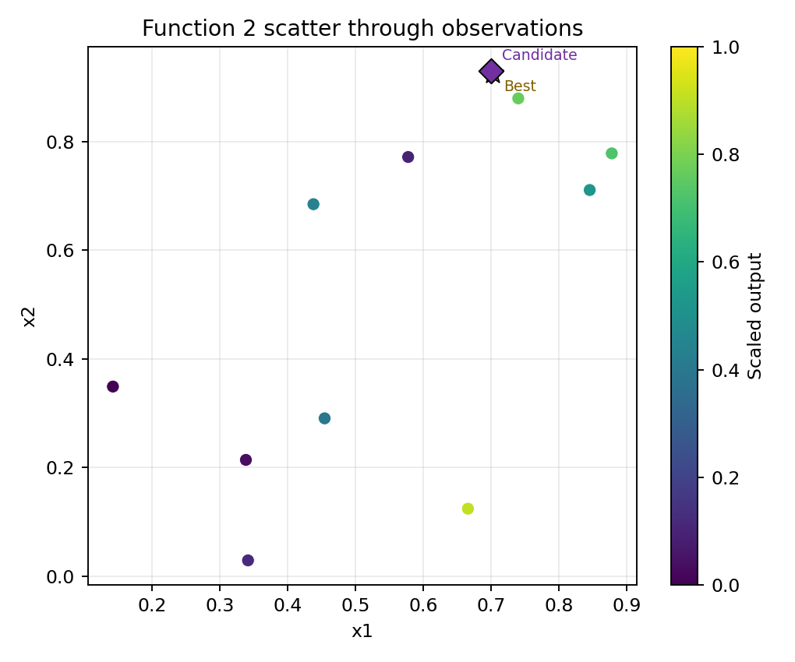
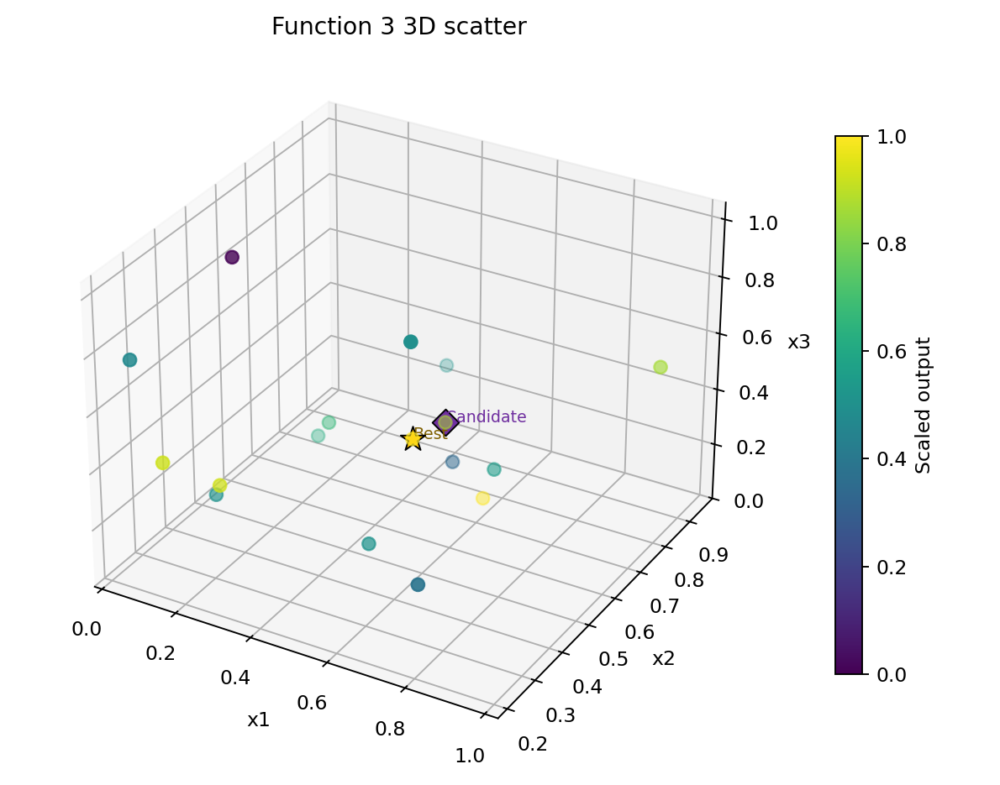
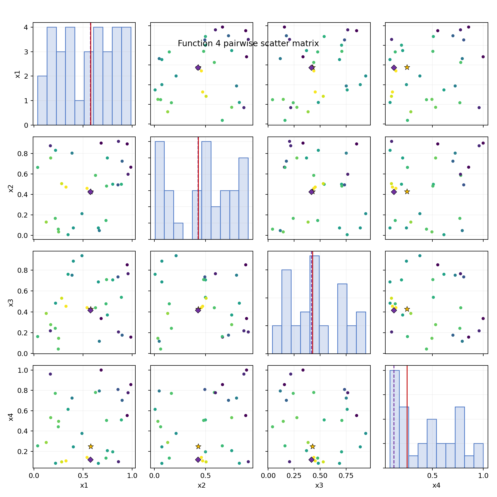

# Week 2 Notes

## Summary
The Week 2 candidates were generated using the trust-region query script and then manually reviewed before selecting the final submission set.

## Lower-Dimensional Visuals
These plots show the accumulated data through Week 2 for Functions 1 to 4, with the Week 2 submitted point overlaid as the candidate marker.

### Function 1

### Function 2

### Function 3

### Function 4

## Why Manual Overrides Were Used
The raw script output was not used unchanged for every function. The main reason is that the remaining query budget is limited, so broad or unstable jumps are harder to justify at this stage.

For lower-dimensional functions, the Gaussian Process suggestions were inspected for whether they stayed close enough to the best historical basin. For higher-dimensional functions, the Random Forest trust-region suggestions were used more directly when they remained local and consistent with the strongest observed region.

## Functions Where the Script Was Overridden
### Functions 1, 2, and 3
The raw Gaussian Process outputs were judged too aggressive or too far from the most credible historical region, so they were replaced with more conservative local refinements.

### Function 4
The script output was considered plausible and was kept with only slight rounding.

### Functions 5, 6, and 8
The script output aligned well with the current best region and was used directly.

### Function 7
The script output stayed near the standout historical best basin, so it was kept in spirit but rounded into a cleaner local move.

## Working Principle
The Week 2 submission follows a trust-region strategy:
- exploit tightly where Week 1 improved performance
- refine cautiously where Week 1 was close but not better
- return to the best historical region where Week 1 clearly underperformed

This reflects a more sample-efficient strategy for the later rounds of the capstone project.
