# Week 3 Notes

## Summary
Week 3 starts from the raw trust-region candidates in `candidates.json`, but the final submission is a blended set based on manual sanity checks and the Week 1 to Week 2 convergence curves.

## Lower-Dimensional Visuals
These plots show the accumulated data through Week 2 for Functions 1 to 4, with the proposed Week 3 candidate overlaid as the candidate marker.

### Function 1
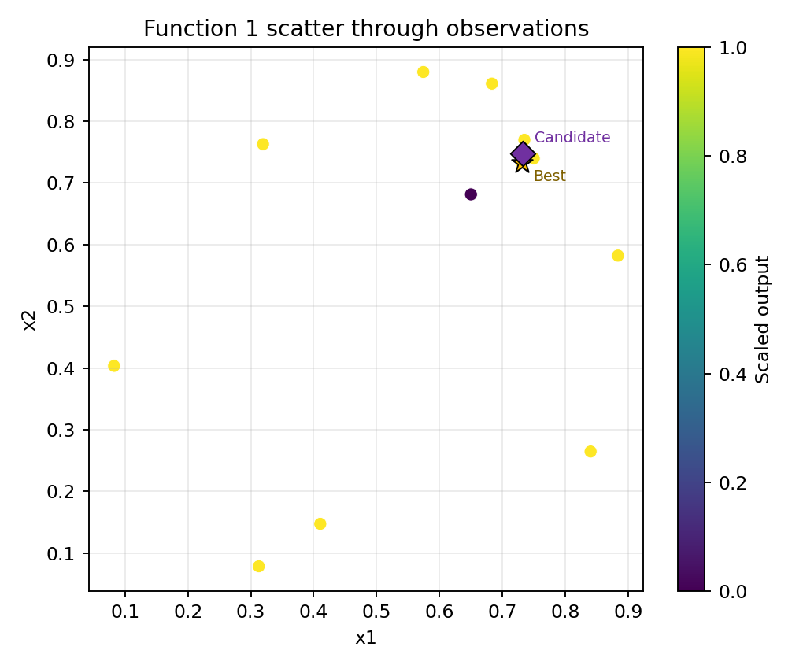

### Function 2
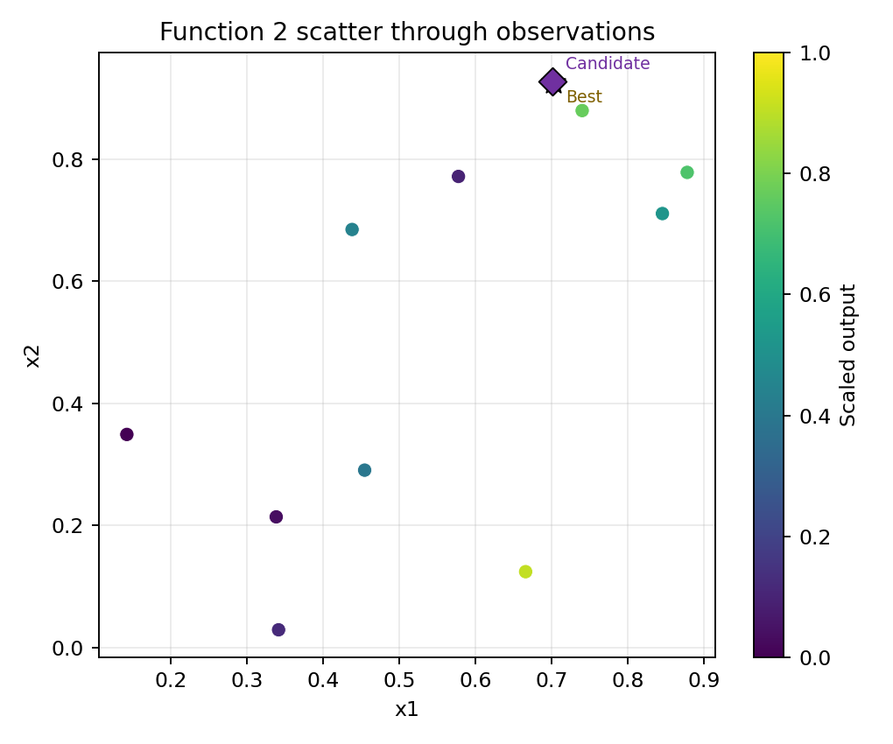

### Function 3
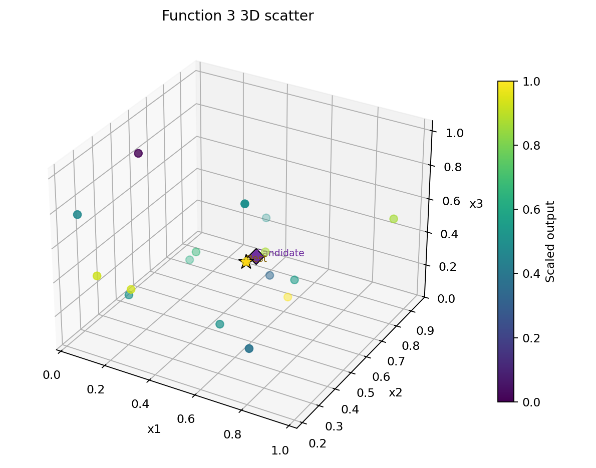

### Function 4
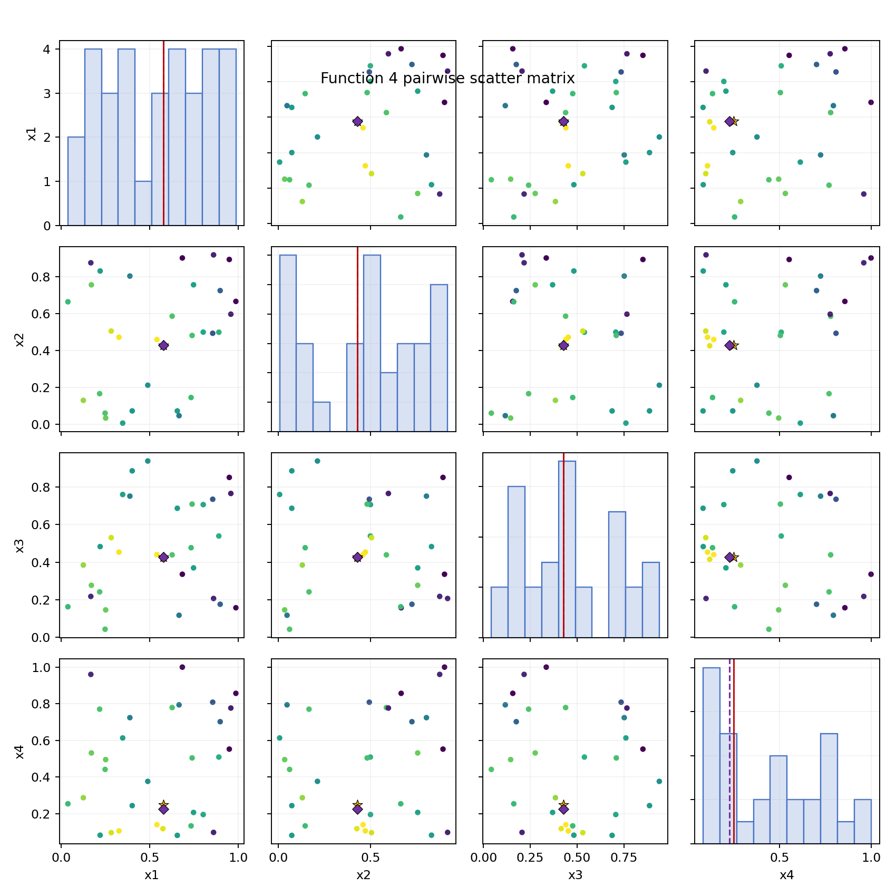

## Convergence View
Convergence plots were generated in `week3/convergence/` for each function plus a combined panel. These plots were used as a quick visual check on whether recent local moves were improving, flattening out, or moving away from the best historical basin.

The plots show:
- blue line: observed outputs by evaluation order
- red line: best-so-far output
- green markers: submitted weekly queries (`W1`, `W2`)
- gold star: current best observed point
- purple diamond: proposed Week 3 candidate

### Combined View
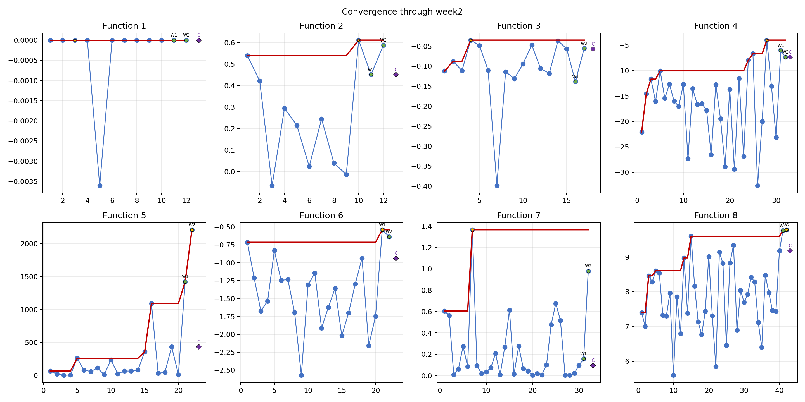

### Function 1
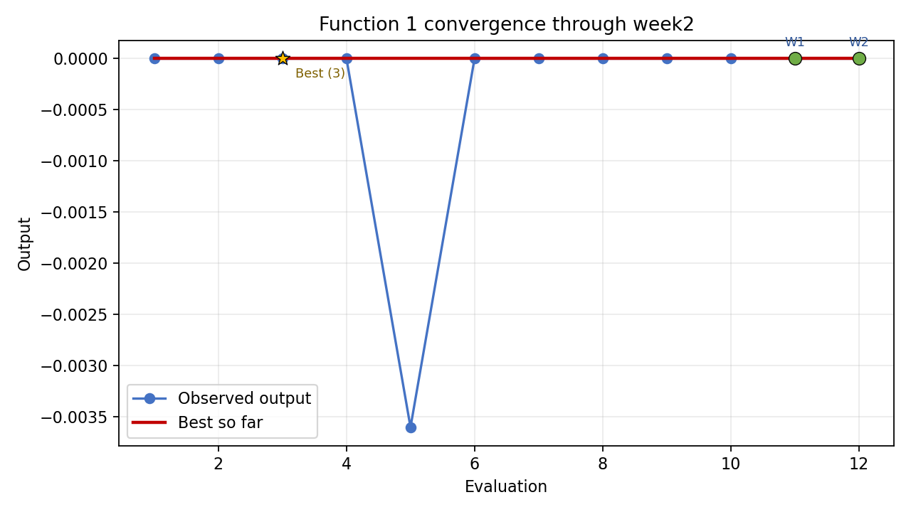

### Function 2
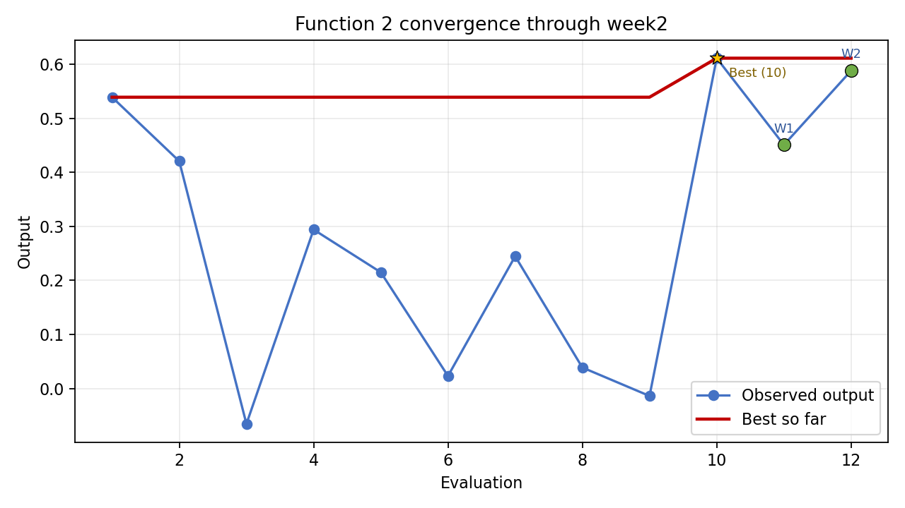

### Function 3
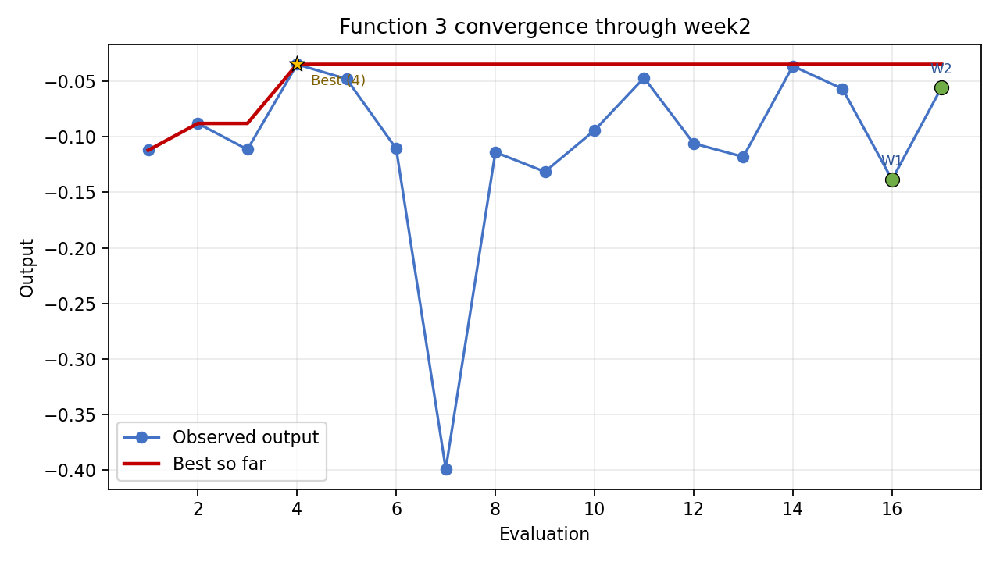

### Function 4
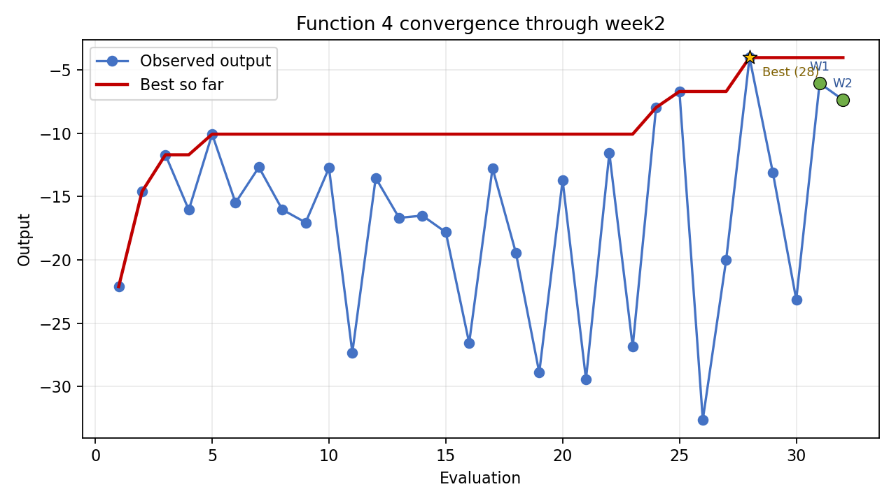

### Function 5
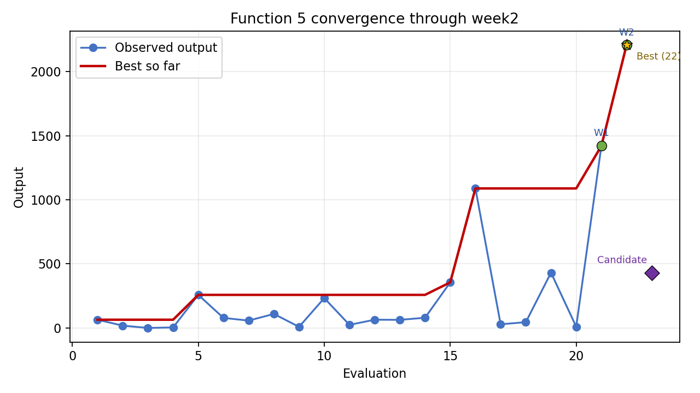

### Function 6
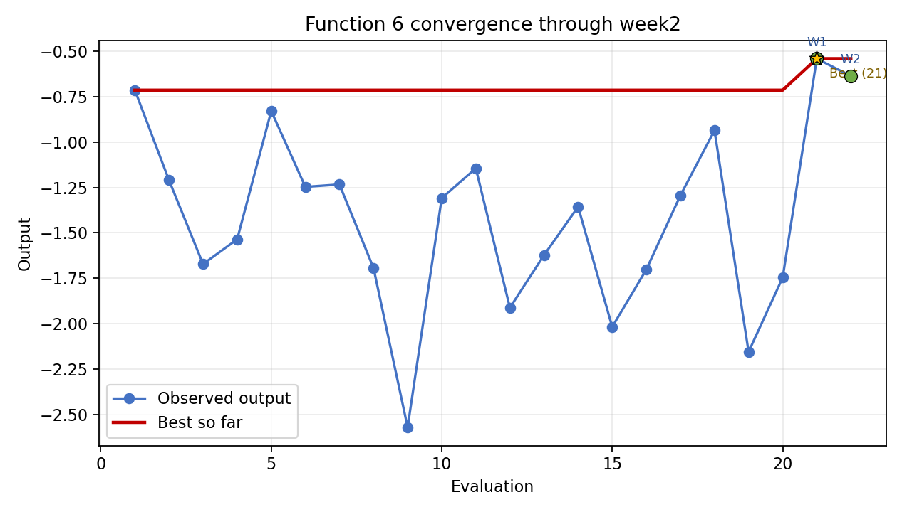

### Function 7
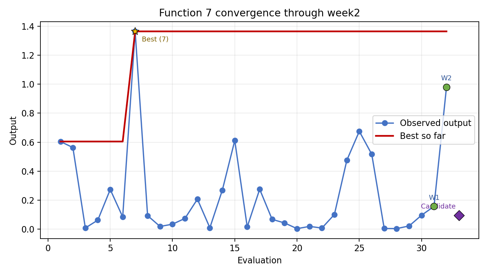

### Function 8
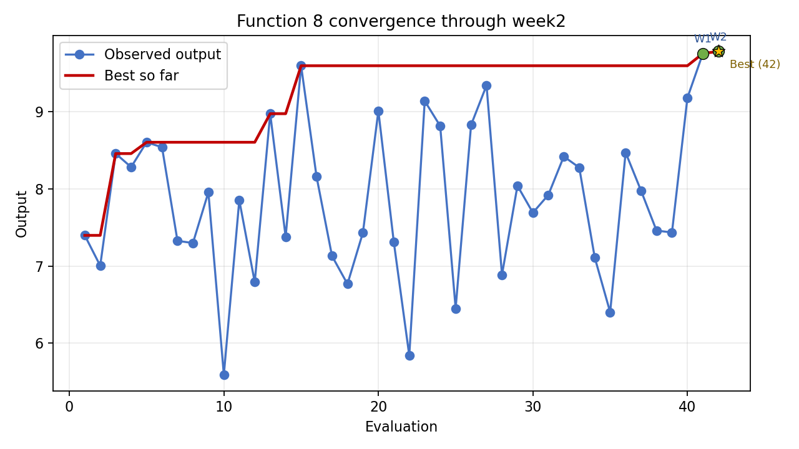

## Blending Rule
- Keep tight local exploitation for functions with confirmed momentum.
- Reset toward the best historical basin when the last move clearly underperformed.
- Use cautious interpolation between the best historical point and the latest improving point when the signal is positive but still below the historical best.

## Function Groups
### Cautious local refinement
Functions 1, 2, and 3 stay close to their best-known regions. Function 1 remains sparse, Function 2 is very close to the best basin, and Function 3 has improved but still has not matched the historical best.

### Reset to best-known basin
Functions 4 and 6 were pulled back toward the best historical point because Week 2 moved away from the strongest region rather than improving it.

### Momentum functions
Functions 5, 7, and 8 keep exploiting locally. Function 5 and Function 8 are clear momentum cases. Function 7 improved strongly in Week 2, but the manual blend keeps it between the historical best point and the recent recovery point rather than trusting the raw candidate at the boundary.
